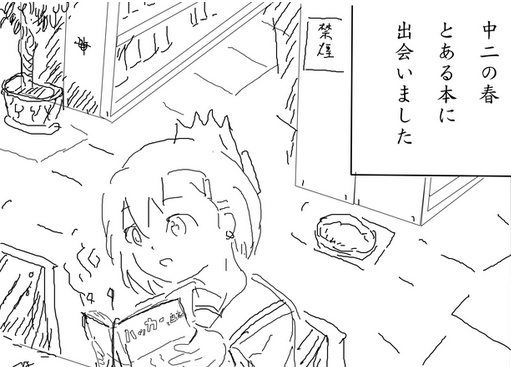

+ 連載 - JavaScript 編
    1. [ハッカーになる](js_001.html)
    1. [はじめての関数](js_002.html)
    1. [はじめてのエディタ](js_003.html)
    1. [関数の関数シリーズ](js_004.html)
       1. [はじめての関数の関数](js_004-1.html)
       1. [はじめてのデータ構造と関数](js_004-2.html)
       1. [はじめての「三種の神器」関数](js_004-3.html)
    1. [はじめての Prototype](js_005.html) 製作中

+ 雑記
    + [はじめまして](memo_001_intro.html)
    + [環境構築](memo_002_environment.html)
    + [野生の JavaScript](memo_003_js_in_wild.html)

+ [参考文献リスト](ref.html)
