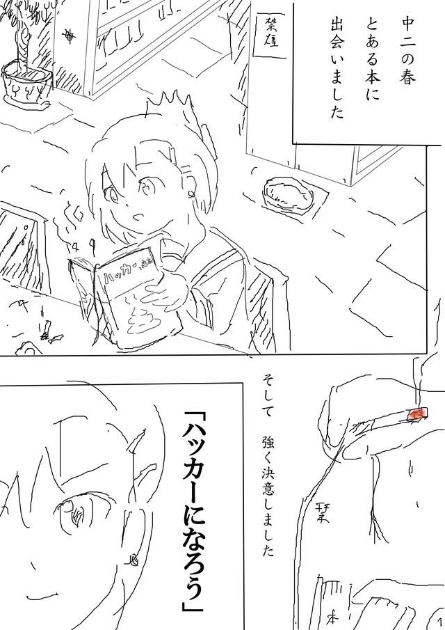
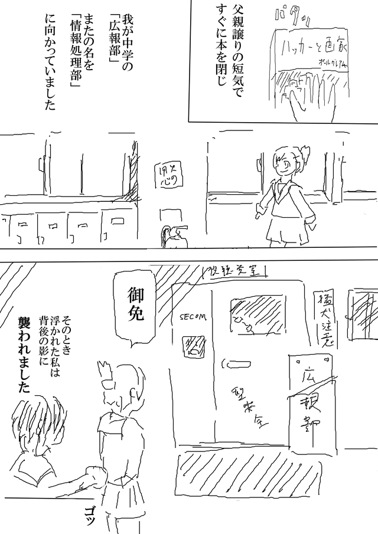
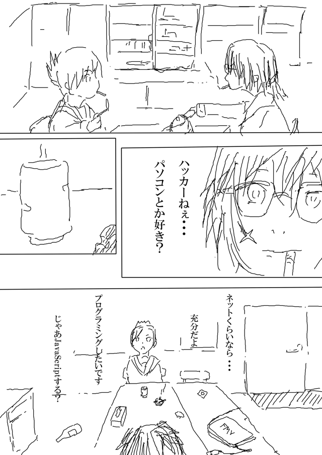
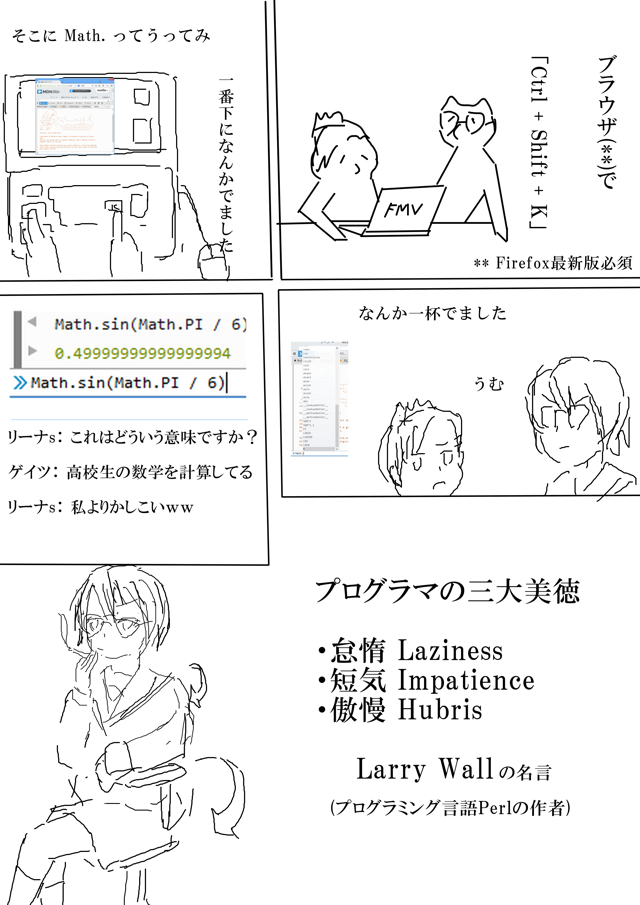

# 1話「ハッカーになる」

*主人公「リーナス松本」は平凡な女子中学生だった。
しかし、とある本を機に抗争に巻き込まれ、ハッカーたちの熱い生き様を体感していく...*



(1/5)

---



(2/5)

---


(3/5)

---



(4/5)

---



(5/5) 一話おわり

---

## まとめ

1. [Firefox最新版を入れる](https://www.mozilla.org/ja/firefox/new/)
1. 「Ctrl + Shift + K」(Macでは Cmd + Option + K)で隠しコマンド(JavaScript)が使えます
1. すごい電卓


``` javascript
Math.sin(Math.PI / 6)
```

$$ \sin(\pi / 6) = 1/2 $$
を計算しています。
JavaScriptには多くの言語と同じく数学用の機能があり、Math.* という感じで呼び出します。

とくに必要ではありませんが、もし文法に興味があれば[ドットインストール](http://dotinstall.com/lessons/basic_javascript_v2)とかで学べます


## 次回予告
「竹内死す」

*SEE YOU SPACE HACKER...*
