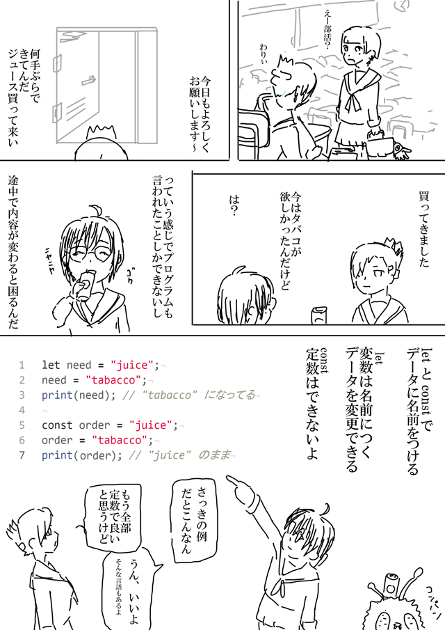
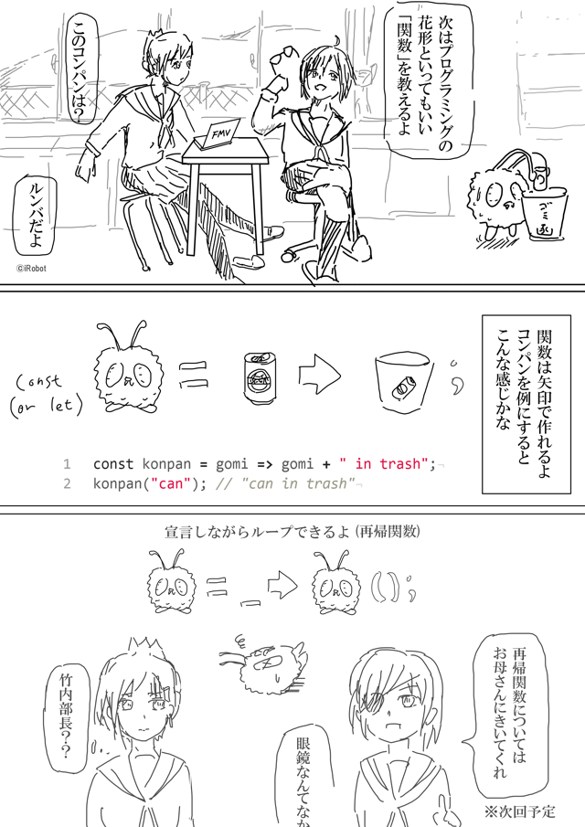
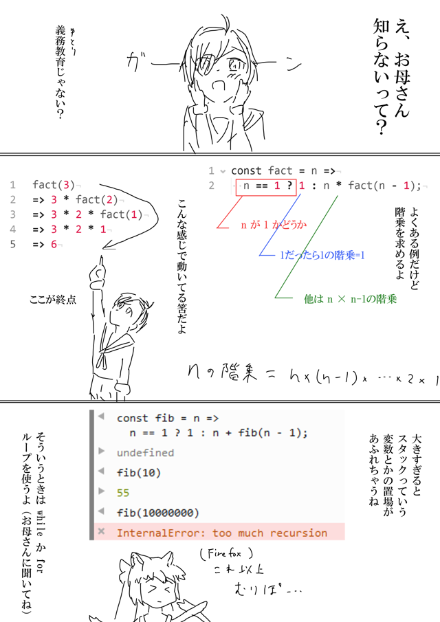

# はじめての関数

プログラミングはじまります！部屋を明るくして、[Firefox最新版を御準備ください。](https://www.mozilla.org/ja/firefox/new/)
文中のコードを参考に、コンソール(「Ctrl + Shift + K」)でぜひ試してみましょう。

### 「変数と定数」



* 変数

    ``` javascript
    let need = "juice";
    need = "tabacco";
    print(need); // "tabacco" になってる
    ```

* 定数

    ``` javascript
    const order = "juice";
    order = "tabacco";
    print(order); // "juice" のまま
    ```

    (註) ``let``、``const``の他に``var``があります。
    JavaScriptでは``var``が未だ一般的ですが、ときどき問題になるので以降もでません

---


### 「関数」




補足(ごちゃごちゃしてごめんなさい)

``` javascript
// 基本
(x, y) => x * y; // (入力) => 出力
((x, y) => x * y)(3, 2); // 関数(入力) で動く、6を返す


// 関数もデータなので名前が付けられる
const square = x => x * x;
square(3); // 9


// 名前で自分も呼べる：再帰
const loop = () => loop();
loop(); // 無限ループでエラー。次回解説します

// 0入力なら ()、入力を無視するなら _ で表現することが多い
// JSは入力の数をチェックしないゆるふわチャンなので、割とどうでもいい
```

(註) JSには他にも関数の作り方はあります。
これはES6の[アロー関数](https://developer.mozilla.org/ja/docs/Web/JavaScript/Reference/arrow_functions)
です。(以降も他の方法は出ませんが、何れも置き換え可能です)

---

### 「再帰関数」



再帰では終了への条件式などを使えば、無限ループを回避できます。

``` javascript
// 条件演算子
1 > 0 ? "あってる" : "ちがう"; // 文字列 "あってる"を出力
1 < 0 ? true : false; // 真偽値 falseを出力

// nの階乗
const fact = n => n == 1 ? 1 : n * fact(n-1);
// nまでの総和
const sigma = n => n == 1 ? 1 : n + sigma(n-1);
```

---

### おまけ

「竹内関数」超複雑な再帰構造になるのでスタック使い果たすより前に処理時間がヤバい

``` javascript
const takeuchi = (x, y, z) =>
  x <= y // 条件式が
  ? y    // true ならここで引き返す
  : takeuchi(takeuchi(x-1, y, z),
             takeuchi(y-1, z, x),
             takeuchi(z-1, x, y)); // false のとき、さらに深く再帰

takeuchi(12, 1, 0); // 3秒くらい
takeuchi(14, 1, 0); // 死亡
```

---

## 次回予告
「竹内死す」

*SEE YOU SPACE HACKER...*
