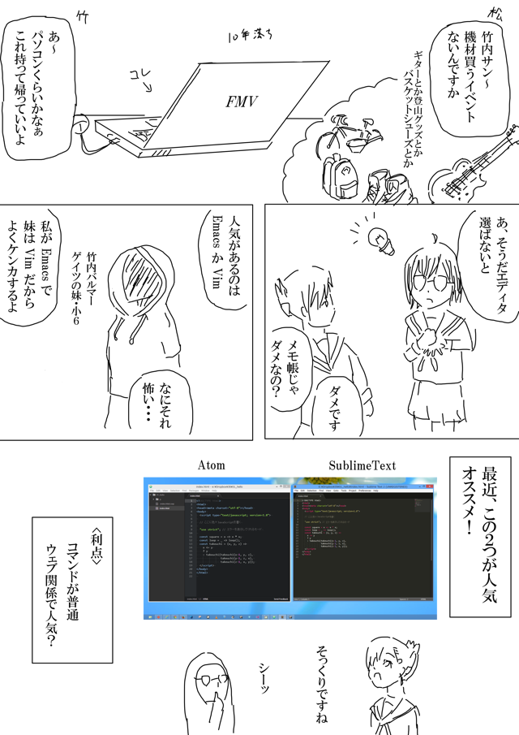
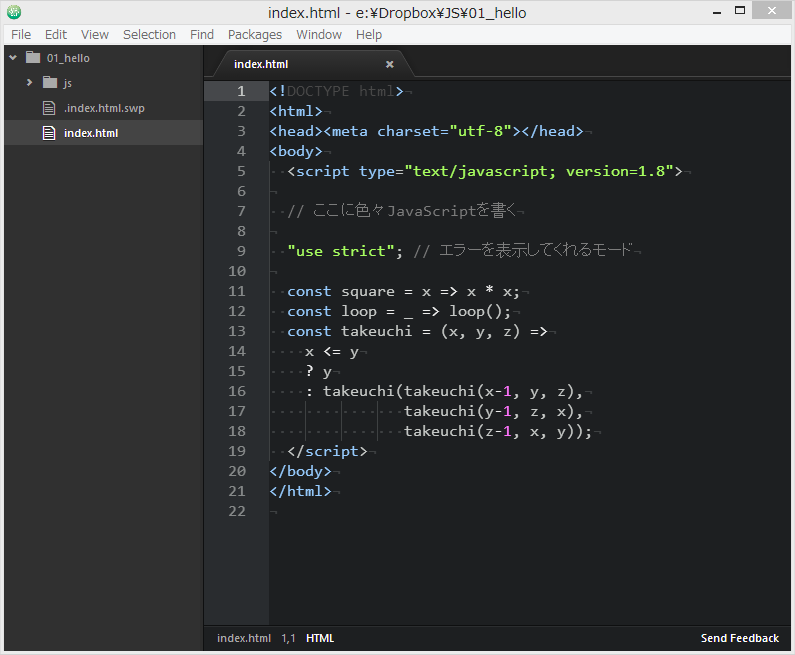
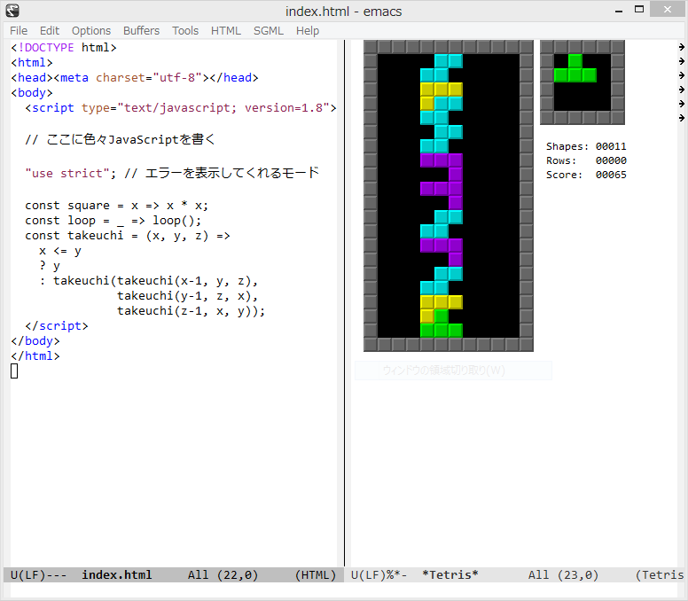
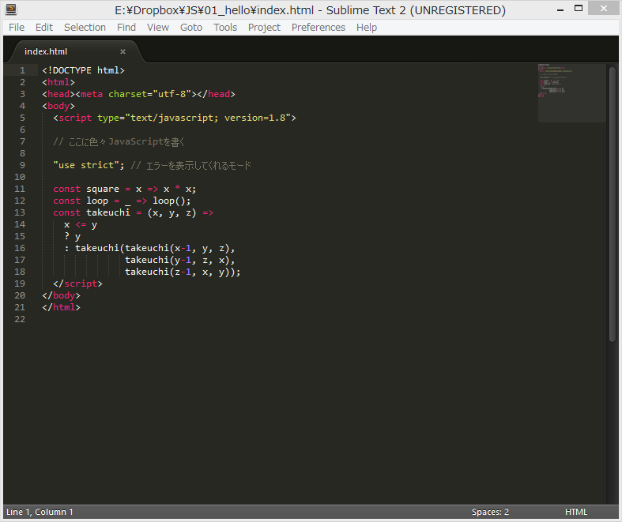
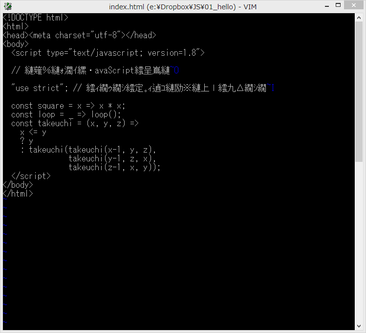

# はじめてのエディタ

今回ちょっとプログラミングは休憩です。部活っぽく道具を揃えましょう。
実はプログラミングはお金のかからない趣味です、拘るのもエディタくらい？



---

各種エディタの紹介。VimとEmacsは[GitBash](http://msysgit.github.io/)に入ってたやつ使ってます。

### [Atom](https://atom.io/)



竹内「WebKitっていうやつでJS製。ちょっと重いかも」


### Emacs



竹内「テトリスとか五目並べが最初から入ってるよ」

### [SublimeText](http://www.sublimetext.com/)



竹内「シェアウェアなので作者に募金できる」

### Vim



竹内「なぜかウガンダに募金できる。本当ごめん、文字化けの直し方知らない」


### おまけ


(註) みなさんは文字化けに苦労したことはありませんか？
ぜひメモ帳ではなく、UTF-8が使えるエディタでUTF-8を使いましょう。

---

### 課題：コードをファイルに保存

皆さん、お気に入りのエディタは見つかりましたか？
それでは以下のHTMLを書いてください。
保存してブラウザで開くと、一度作った関数がコンソール(Ctrl+Shift+K)でいつも使えます。
（次回使います！）

``` html
<!DOCTYPE html>
<html>
<head><meta charset="utf-8"></head>
<body>
  <script type="text/javascript; version=1.8">

  // ここに色々JavaScriptを書く

  "use strict"; // エラーを表示してくれるモード

  const square = x => x * x;

  const loop = _ => loop();

  const takeuchi = (x, y, z) =>
    x <= y
    ? y
    : takeuchi(takeuchi(x-1, y, z),
               takeuchi(y-1, z, x),
               takeuchi(z-1, x, y));
  </script>
</body>
</html>
```

## 次回予告
「竹内死す」

*SEE YOU SPACE HACKERS...*
